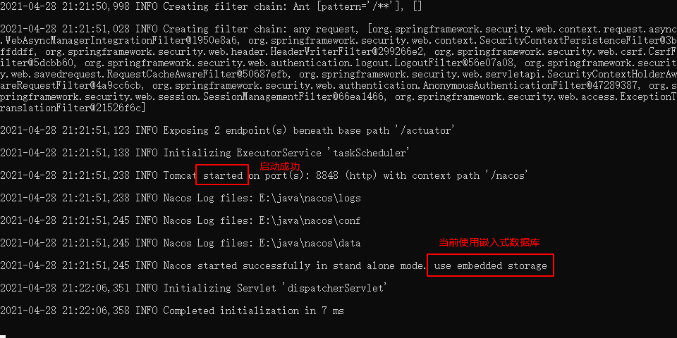

## `nacos`

> 链接：[https://nacos.io/zh-cn/](https://nacos.io/zh-cn/)
>
> 手册：[https://nacos.io/zh-cn/docs/what-is-nacos.html](https://nacos.io/zh-cn/docs/what-is-nacos.html)
>
> 外置数据库

## nacos启动

> - 使用嵌入式数据库(内存数据库)
>
> 
>
> - 使用外转MYSQL数据库
>
>   1. 初始化脚本：`config/nacos-mysql.sql`
>
>   2. 创建数据库
>
>      > 
>
>   3. 修改配置
>
>      > 
>
>   4. 再次启动
>
>      > 
>
> 
>
> 

## nacos登录 

> 默认帐号：nacos/nacos
>

## nacos配置中心

### 引入相关的坐标


### 创建启动配置文件`bootstrap.yml`

> ```yml
> # 配置配置中心的服务地址
> spring:
>   application:
>     # 配置应用名称
>     name: msc-provider-depart
>   cloud:
>     nacos:
>       # 配置中心相关配置
>       config:
>         # 配置中心地址
>         server-addr: localhost:8847,localhost:8848,localhost:8849
>         # 配置文件扩展名称
>         file-extension: yml
>   profiles: # 配置文件只有获取，看不到！！！安全性也有保证
>     active: prod
> ```

### 在nacos 的配置中心添加一个配置文件

> **Data ID的文件名称需要与微服务的名称一致，nacos 通过微服务名称来取配置文件的信息**
>
> 

### nacos动态更新配置

> **需要在对应的bean 对象中添加注解，以支持动态更新配置信息**
>
> ```java
> @Service
> @RefreshScope//刷新作用域： 在代码运行期，将对象的属性值更新
> public class DepartServiceImpl implements DepartService {
>     @Value("${depart.name:UNKNOWN-VALUE}")
>     private String departName;
> }
> ```

